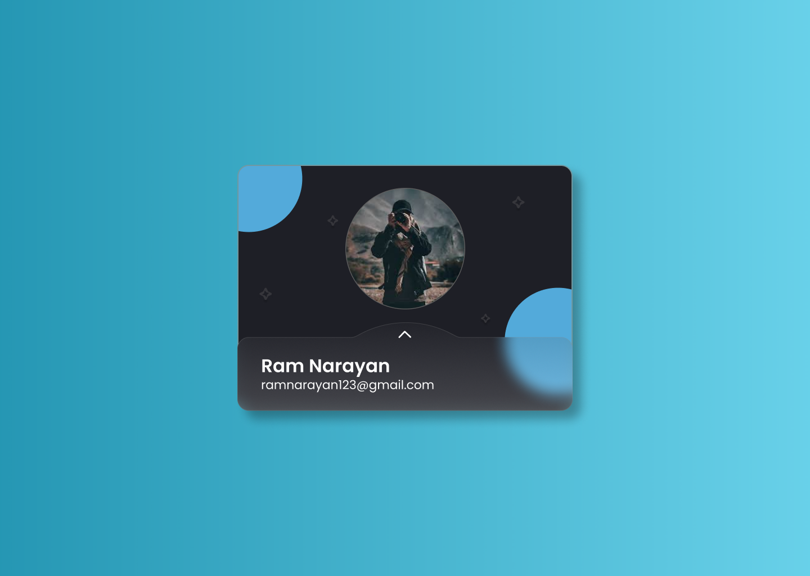

# Card Flip Project  

A simple card-flipping animation designed in Figma and developed using HTML and CSS.

---

## Features  
- Smooth card-flipping animation.  
- Responsive design for all devices.  
- Customizable card content.  

---

## Technologies Used  
- HTML5  
- CSS3  

---

## Links  
- **Live Website**: [View Here](https://dark1arrow.github.io/card-flip/) 
- **Figma Design**: [View on Figma](https://www.figma.com/design/KRgfLIlf1jTh55Be1dAu6z/Cards?fuid=1331957299204890869)
- **LinkedIn Profile**: [Visit My LinkedIn](https://www.linkedin.com/in/gouatm-khanna-61ba63262/?utm_source=share&utm_campaign=share_via&utm_content=profile&utm_medium=android_app)
---

## Acknowledgements  
- Designed in Figma.  
- Developed using HTML and CSS.  
- Inspired by modern web design trends.  
